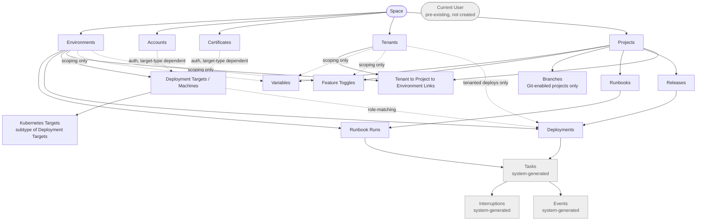

# Octopus Deploy — Tier 1 Resource Dependency Tree

Dependency map for the Tier 1 (dedicated MCP tool) resources: Spaces, Environments,
Projects, Accounts, Certificates, Tenants, Variables, Feature Toggles, Branches,
Runbooks, Releases, Deployments, Deployment Targets/Machines, Kubernetes Targets,
Tasks, Interruptions, Events, and Current User.

- **Solid arrow** = hard dependency (the parent must exist before the child can be created at all)
- **Dashed arrow** = soft dependency (optional — only needed if you scope/link to it)

## Hard vs. soft dependencies

| Resource | Hard dependency (required to create) | Soft dependency (optional scoping/linking) |
|---|---|---|
| Environments | Space | — |
| Accounts | Space | — |
| Certificates | Space | — |
| Tenants | Space | — |
| Projects | Space (uses auto-default Lifecycle) | — |
| Variables | Project | Environments, Machines, Tenants, Channels (for scoped values) |
| Feature Toggles | Project | Environments, Tenants, Tenant Tags/Segments (for scoped toggles) |
| Branches | Project (with Git version control enabled) | — |
| Runbooks | Project | — |
| Runbook Runs | Runbook (published) + Environment | — |
| Releases | Project + Deployment Process | — |
| Deployment Targets / Machines | Environment | Accounts, Certificates (only for target types needing cloud/cert auth) |
| Kubernetes Targets | Environment (subtype of Deployment Targets) | Accounts, Certificates (cluster auth) |
| Deployments | Release + Environment | Deployment Targets (role matching), Tenants (tenanted deploys) |
| Tenant↔Project↔Environment Links | Tenants + Projects + Environments | — |
| Tasks | *(system-generated by Deployments/Runbook Runs — not created directly)* | |
| Interruptions | *(system-generated by Tasks needing manual intervention)* | |
| Events | *(system-generated byproduct of any action)* | |
| Current User | *(pre-existing authenticated identity — not created)* | |

## Answers to the specific questions

**Can you create variables before environments?**
Yes. Variables only hard-require a **Project**. Environments are only needed if you
want to scope a variable's value to a specific environment — an unscoped (or
channel-scoped) variable can be created with zero environments in the space.

**Can you have feature toggles without creating tenants first?**
Yes. Feature Toggles only hard-require a **Project**. Tenants are one optional
scoping dimension (alongside Environments and Segments) — a global or
environment-scoped toggle needs no tenants at all.

## Notable non-obvious points

- Environments don't gate **Project** creation — the default Lifecycle has no
  phase restrictions, so a Project can exist with zero Environments. Environments
  only become a hard blocker at **Deployment** time and at **Deployment Target**
  creation.
- **Accounts/Certificates** aren't a blanket prerequisite for Deployment Targets —
  only for target types whose auth mechanism needs them (e.g. Azure/AWS targets,
  Kubernetes client-cert auth). A Listening/Polling Tentacle target needs neither.
- **Tasks, Interruptions, and Events** aren't creatable resources — they're
  system-generated records that fall out of Deployments and Runbook Runs.
